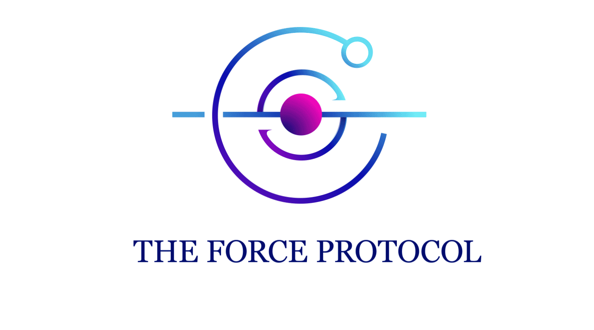
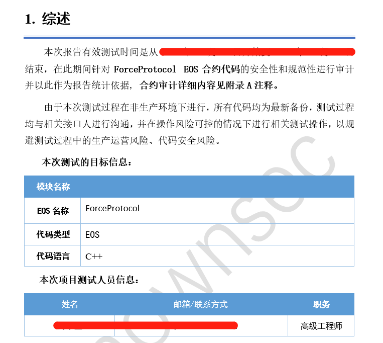
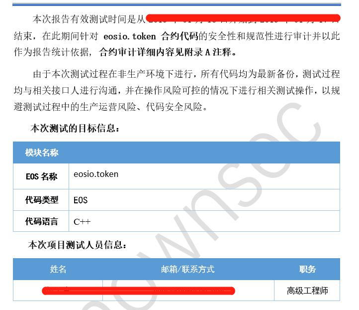

## The Force Protocol on EOS

	
	      
	

原力协议项目已开发一年多的时间，协议层核心代码基本已经部署完成，EOS DAPP已经上线，代码会逐步开源。

- 技术特点

基于不同的金融场景打造金融服务平台，把借贷和稳定币两者在跨链技术层面上进行结合，打造链上的货币市场，未来会扩展到借贷与稳定币之外的金融场景。

- 机构投资

科银资本、回向基金、AlphaCoin Fund、Spark Capital、加密愿景、犇睿资本等专业机构战略投资。

- 合作机构

AlphaCoin Fund深度孵化，作为火币超级节点，IOST、CMT等项目的节点，过去投资和孵化了IOST、RSK、Celer、Top等Top 100顶级项目，专注打造重磅项目。与KCASH、TokenInsight、InVault、Hashgard等知名项目形成长期战略合作，共建分布式金融生态。

- 团队成员

主要成员来自清华、浙大、中科院、北航等国内顶级名校硕博士，技术实力雄厚，传统基金和互联网金融行业背景为项目发展带来更多落地资源。

- 资金情况

借贷业务和自营原力矿场业务为项目发展输入稳定现金流，可以支撑项目长久可持续发展，是圈内为数不多有正现金流的公司。

----------

### force.protocol

功能：EOS平台的智能合约，实现的功能参考原力协议官网 https://www.theforceprotocol.com 的EOS币币贷产品。

语言：C++

审核：开源代码已经经过第三方机构审核

	
	      
	

说明：force.protocol代码为2018年10月的历史代码，希望对EOS区块链开发工程师有参考意义。如果想更深层次的了解合约业务，可发邮件至  michael@theforceprotocol.com

### eosio.token

功能：EOS生成代币的代码

语言：C++

审核：代码已经经过第三方机构审核

	
	      
	

生成 token 的流程如下：

- 创建钱包

- 创建私钥

- 私钥导入到钱包

- 部署合约

说明：eosio.token 代码为2018年7月的历史代码，团队在 EOS DAPP 研发的过程中，已经有很多经验积累，如果对相关的技术细节感兴趣，可联系 michael@theforceprotocol.com
